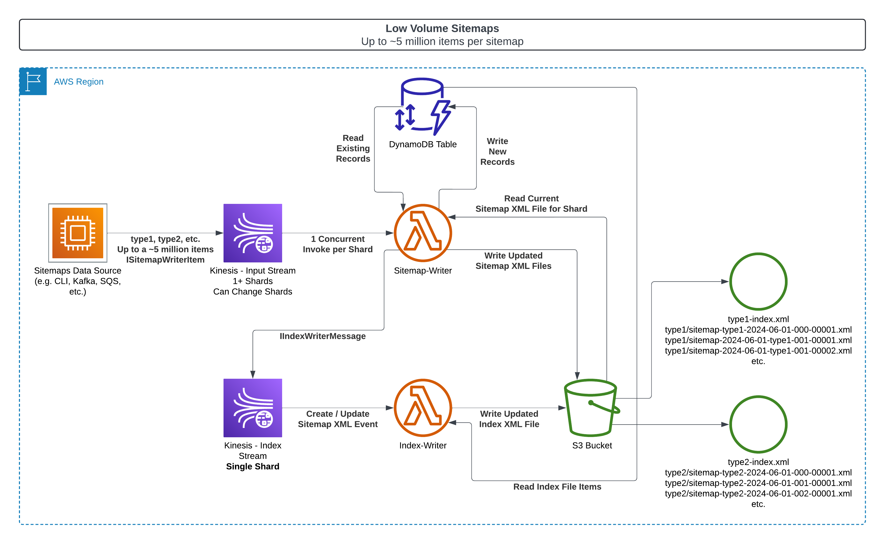
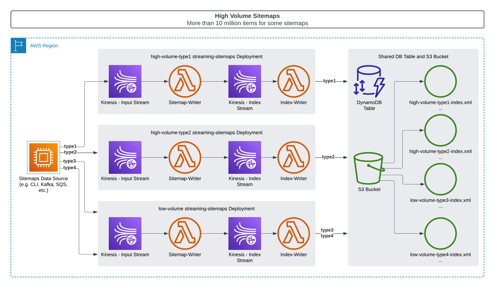

# Streaming Sitemaps

Streaming Sitemaps is a comprehensive solution for generating and managing XML sitemaps for large-scale websites. It provides a set of tools and AWS CDK constructs to create, convert, download, and manage sitemaps in an efficient and scalable manner.

- [sitemaps-cdk](packages/sitemaps-cdk/API.md)
  - AWS CDK construct to create set of AWS Lambda functions:
    - Sitemap Writer - Generate XML sitemaps from a stream of sitemap JSON items delivered via an AWS Kinesis stream
    - Index Writer - Maintain an XML sitemap index that is updated when new sitemap XML files are created
    - Freshener - Rebuild the sitemap index and sitemap XML files on demand (this applies changes to older items that were saved to the DB but not written to the XML files immediately)
  - Saves record of each item in a DynamoDB table, for deduplication, marking deletes, and to enable the Freshener to rebuild the sitemap index and sitemap XML files on demand
- [sitemaps-cli](packages/sitemaps-cli/README.md)
  - `convert` - Convert an XML or XML.gz sitemap to JSON, from a file or HTTP URL
  - `create from-csv` - Create a sitemap index and sitemap files from CSV file
  - `create from-dynamodb` - Create a sitemap index and/or sitemap files DynamoDB Table
  - `download` - Download sitemap index and all sitemaps linked by a sitemap index; `s3://` URLs are supported if AWS credentials are available - For indices the `http[s]://hostname` of the individual sitemaps will be replaced with the `s3://[bucket_name]/` of the sitemap index
  - `mirror-to-s3` - Mirror a sitemap index and all sitemaps linked by a sitemap index to an S3 bucket
  - `upload-to-s3` - Upload local sitemap index and sitemaps to S3

# Table of Contents <!-- omit in toc -->

- [Streaming Sitemaps](#streaming-sitemaps)
- [Deployment Patterns](#deployment-patterns)
  - [Low Volume Deploys](#low-volume-deploys)
  - [High Volume Deploys](#high-volume-deploys)
- [Installation](#installation)
  - [Sitemaps CLI](#sitemaps-cli)
  - [CDK Constructs](#cdk-constructs)
    - [Example CDK Stack](#example-cdk-stack)
- [License](#license)

# Deployment Patterns

## Low Volume Deploys

- Low Volume sitemaps typically have 5 million or less items in each sitemap
- Low Volume sitemaps can be written by a single shared `sitemap-writer` and `index-writer` deployment
- The point at which a deployment would need to switch to High Volume is determined both by the total number of items, but also by the frequency of update messages for older items
  - Updates for items not in the current file will slow down throughput substantially
  - These updates can be written into the DB directly by a pre-processing lambda, or by the `sitemap-writer` lambda
  - Writing the updates in a preprocessor will keep the XML file write density high and will allow using the simpler low-volume deploy pattern for longer
- The DynamoDB Table and S3 Bucket, and Freshener deployment are both shared by all sitemaps



## High Volume Deploys



- High Volume sitemaps typically have 10 million or more items in each sitemap
- High Volume sitemaps have a dedicated `sitemap-writer` and `index-writer` for the high volume types
- High Volume deployments can share a DynamoDB Table, S3 Bucket, and Freshener deployment with Low Volume deployments and with other High Volume deployments
- A type can be migrated from Low Volume to High Volume and vice versa as needed

# Installation

## Sitemaps CLI

```sh
npm install -g @shutterstock/sitemaps-cli

sitemaps-cli help
```

## CDK Constructs

```sh
npm install --save-dev @shutterstock/sitemaps-cdk
```

### Example CDK Stack

[Example CDK Stack](packages/cdk/lib/cdk-stack.ts)

# License

Streaming Sitemaps is licensed under the MIT License. For more information, see the [LICENSE.md](LICENSE.md) file.
