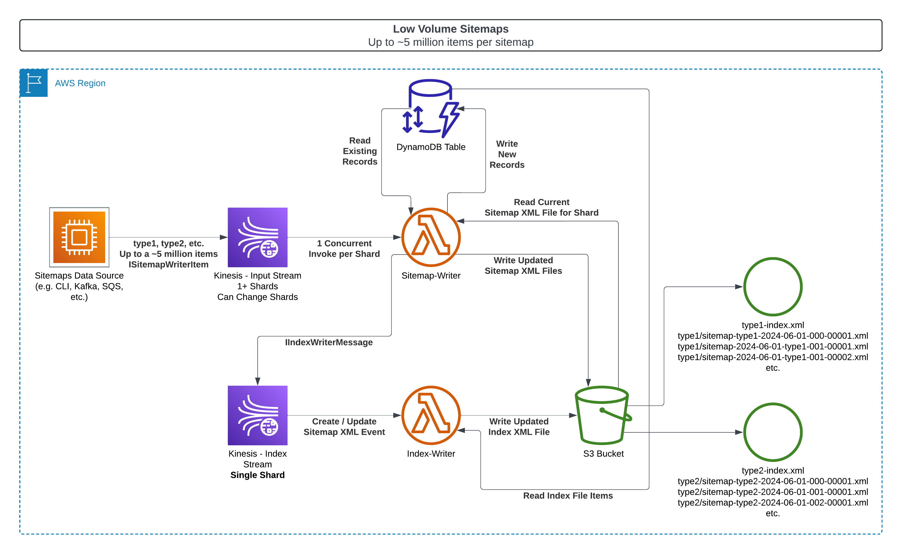
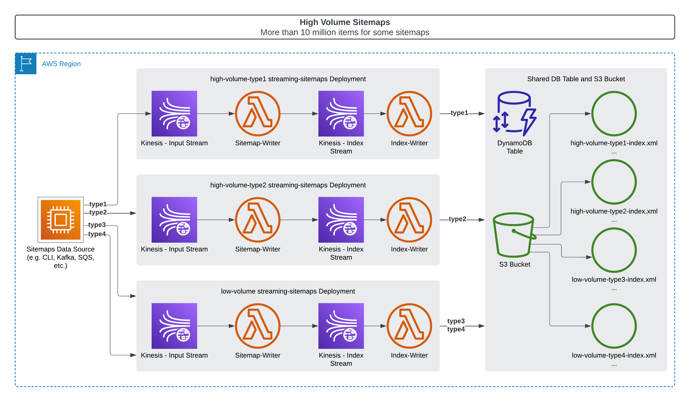

# Streaming Sitemaps

Streaming Sitemaps is a comprehensive solution for generating and managing XML sitemaps for large-scale websites. It provides a set of tools and AWS CDK constructs to create, convert, download, and manage sitemaps in an efficient and scalable manner.

- [sitemaps-cdk](packages/sitemaps-cdk/API.md)
  - AWS CDK construct to create set of AWS Lambda functions:
    - Sitemap Writer - Generate XML sitemaps from a stream of sitemap JSON items delivered via an AWS Kinesis stream
    - Index Writer - Maintain an XML sitemap index that is updated when new sitemap XML files are created
    - Freshener - Rebuild the sitemap index and sitemap XML files on demand (this applies changes to older items that were saved to the DB but not written to the XML files immediately)
  - Saves record of each item in a DynamoDB table, for deduplication, marking deletes, and to enable the Freshener to rebuild the sitemap index and sitemap XML files on demand
- [sitemaps-cli](packages/sitemaps-cli/README.md)
  - `convert` - Convert an XML or XML.gz sitemap to JSON, from a file or HTTP URL
  - `create from-csv` - Create a sitemap index and sitemap files from CSV file
  - `create from-dynamodb` - Create a sitemap index and/or sitemap files DynamoDB Table
  - `download` - Download sitemap index and all sitemaps linked by a sitemap index; `s3://` URLs are supported if AWS credentials are available - For indices the `http[s]://hostname` of the individual sitemaps will be replaced with the `s3://[bucket_name]/` of the sitemap index
  - `mirror-to-s3` - Mirror a sitemap index and all sitemaps linked by a sitemap index to an S3 bucket
  - `upload-to-s3` - Upload local sitemap index and sitemaps to S3

# Table of Contents <!-- omit in toc -->

- [Streaming Sitemaps](#streaming-sitemaps)
- [Deployment Patterns](#deployment-patterns)
  - [Low Volume Deploys](#low-volume-deploys)
  - [High Volume Deploys](#high-volume-deploys)
- [Installation](#installation)
  - [Sitemaps CLI](#sitemaps-cli)
  - [CDK Constructs](#cdk-constructs)
    - [Example CDK Stack](#example-cdk-stack)
- [Packaged CLI verification](#packaged-cli-verification)
- [License](#license)

# Deployment Patterns

## Low Volume Deploys

- Low Volume sitemaps typically have 5 million or less items in each sitemap
- Low Volume sitemaps can be written by a single shared `sitemap-writer` and `index-writer` deployment
- The point at which a deployment would need to switch to High Volume is determined both by the total number of items, but also by the frequency of update messages for older items
  - Updates for items not in the current file will slow down throughput substantially
  - These updates can be written into the DB directly by a pre-processing lambda, or by the `sitemap-writer` lambda
  - Writing the updates in a preprocessor will keep the XML file write density high and will allow using the simpler low-volume deploy pattern for longer
- The DynamoDB Table and S3 Bucket, and Freshener deployment are both shared by all sitemaps



## High Volume Deploys



- High Volume sitemaps typically have 10 million or more items in each sitemap
- High Volume sitemaps have a dedicated `sitemap-writer` and `index-writer` for the high volume types
- High Volume deployments can share a DynamoDB Table, S3 Bucket, and Freshener deployment with Low Volume deployments and with other High Volume deployments
- A type can be migrated from Low Volume to High Volume and vice versa as needed

# Installation

## Sitemaps CLI

```sh
npm install -g @shutterstock/sitemaps-cli

sitemaps-cli help
```

## CDK Constructs

```sh
npm install --save-dev @shutterstock/sitemaps-cdk
```

### Example CDK Stack

[Example CDK Stack](packages/cdk/lib/cdk-stack.ts)

# Packaged CLI verification

With Node 24 and pnpm 12.7.0, run:

```sh
pnpm install --frozen-lockfile
pnpm run build:all
pnpm run test
pnpm run build:cli
pnpm run test:cli:packaged
```

Rebuild the CLI after unit tests, which emit unbundled commands for AWS mocks.
The packaged check packs the CLI and its three public sibling libraries, then
installs them with `pnpm install --prod` and hoisting disabled in a temporary
directory outside the workspace. Bin shims cannot inject `NODE_PATH`. A read-only
localhost registry serves only those actual sibling
tarballs at their source/materialized versions; it never publishes or substitutes
registry copies. External dependencies use the public npm registry and the
seven-day release-age policy. Network access to npm is required for installation.

The consumer has a fresh home, store and configuration, no credentials, source
links, ancestor dependencies, `NODE_PATH`, or global package binaries. A separate
tools directory supplies TypeScript and Node types without providing declaration
dependencies. Checks cover every shipped CLI declaration with `skipLibCheck`
disabled, the installed bin, version/help, command and plugin loading, helper
usage, and offline XML conversion against committed output. Negative controls
must detect missing `sitemap`, `fs-extra`, and the installed bin. Network calls
are blocked during CLI execution; AWS services and deployment are not exercised.
The check also verifies the root lock and dependency trees stay unchanged, restores
the CLI README changed by pack hooks, and removes temporary fixtures/locks.
Library source versions remain `0.0.0`; no second lockfile is committed. PR CI runs this
check after version materialization and builds, without saving consumer caches.

# License

Streaming Sitemaps is licensed under the MIT License. For more information, see the [LICENSE.md](LICENSE.md) file.
